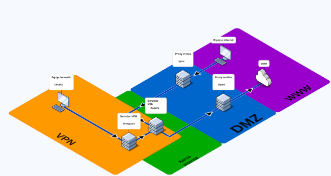
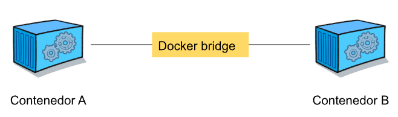
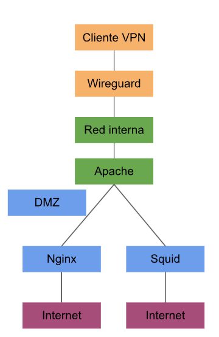
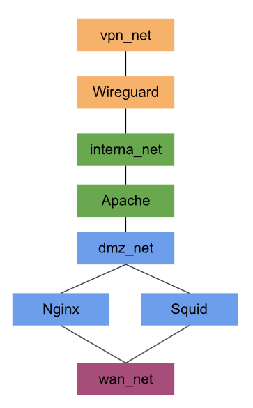
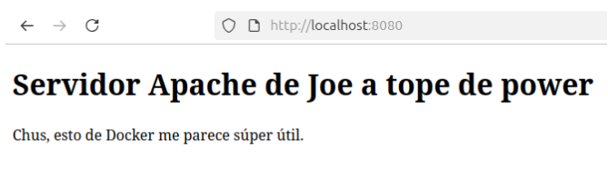

# CREACIÓN DE UN ESCENARIO EMPRESARIAL PROTOTIPO CON DOCKER COMPOSE

---



En esta práctica vamos a mirar de crear un escenario en una misma máquina con sistema Ubuntu 24.04 desktop con Docker Compose. De esta manera podremos simular múltiples redes aisladas, una en cada contenedor, y así poder conectarse entre ellos.

---

## MÁQUINAS DEL ESCENARIO

---

En esta práctica vamos a simular 4 escenarios distintos: 

- VPN → Esta es la zona desde donde el cliente podría trabajar desde su casa, conectándose a la red interna de la empresa a través de un túnel VPN.

En esta zona vamos a simular un **Equipo doméstico Ubuntu** y un **Servidor VPN Wireguard**.

- Red interna → Esta es la zona que simula la LAN de la empresa, la zona de trabajo que evita riesgos gracias a las protecciones externas como la VPN y los Proxies. Es decir, es la zona segura a la que hay que llegar tras pasar el túnel VPN por un lado, o los filtros de un Proxy por el otro lado.

Aquí vamos a simular un **Servidor Web Apache**.

- DMZ → Esta es la zona desmilitarizada, es decir, la zona que separa la red segura de la empresa de la red insegura de internet. 

Es aquí donde simularemos **2 servidores Proxy**: **Un servidor Proxy de salida (Squid)** y **Un servidor Proxy de entrada (Nginx)**.

- WWW → Esta es la zona que simula internet fuera de la red empresarial y los clientes externos.
Aquí simularemos un cliente externo con Ubuntu y la salida a internet.

---

## ARQUITECTURA DE MONTAJE

---

| Zona   | Red Docker  | Contenedores     |
|--------|-------------|------------------|
| VPN    | vpn_net   | wireguard        |
| Interna| internal_net | apache        |
| DMZ    | dmz_net   | nginx y squid    |
| WAN    | wan_net   | cliente externo / internet |

---

## PREPARACIÓN DE MÁQUINA BASE EN VIRTUALBOX CON UBUNTU 24.04 LTS

---

Antes de seguir, lo primero que deberemos hacer es preparar la máquina que utilizaremos como base para instalar Docker y los respectivos contenedores para crear la infraestructura.

En este caso, vamos a utilizar la OVA de una máquina limpia con la distribución de Ubuntu 24.04. Cambiaremos la RAM de la máquina a un mínimo de 4GB (aunque si es más, mejor), a 2 CPUs mínimo, y pondremos el adaptador de red en NAT.

Una vez arrancada la máquina y actualizada con un **update && upgrade** vamos a proceder a instalar Docker siguiendo el comando que nos compartió nuestro profesor y tutor Chus.

```bash
joel@joeldocker:~$ sudo apt install docker.io docker-compose-v2 -y
Leyendo lista de paquetes... Hecho
Creando árbol de dependencias... Hecho
Leyendo la información de estado... Hecho
El paquete indicado a continuación se instaló de forma automática y ya no es necesario.
  libllvm19
```
Verificamos la instalación mirando la versión del docker.

```bash
joel@joeldocker:~$ sudo docker version
Client:
 Version:           28.2.2
 API version:       1.50
 Go version:        go1.23.1
 Git commit:        28.2.2-0ubuntu1~24.04.1
 Built:             Wed Sep 10 14:16:39 2025
 OS/Arch:           linux/amd64
 Context:           default

Server:
 Engine:
  Version:          28.2.2
  API version:      1.50 (minimum version 1.24)
  Go version:       go1.23.1
  Git commit:       28.2.2-0ubuntu1~24.04.1
  Built:            Wed Sep 10 14:16:39 2025
  OS/Arch:          linux/amd64
  Experimental:     false
 containerd:
  Version:          1.7.28
  GitCommit:        
 runc:
  Version:          1.3.3-0ubuntu1~24.04.3
  GitCommit:        
 docker-init:
  Version:          0.19.0
  GitCommit:        
joel@joeldocker:~$ sudo docker compose version
Docker Compose version 2.37.1+ds1-0ubuntu2~24.04.1
```

Ahora ya sabemos que docker está instalado correctamente, pero cada vez que queramos usarlo vamos a tener que hacerlo con **sudo**. Para evitarlo, vamos a ejecutarlo sin sudo de esta forma:

```bash
joel@joeldocker:~$ sudo usermod -aG docker $USER
```
```bash
joel@joeldocker:~$ docker ps
CONTAINER ID   IMAGE     COMMAND   CREATED   STATUS    PORTS     NAMES
```
Ahora vamos a organizar los directorios en los que guardaremos los archivos de configuración de los contenedores de docker, con tal de tenerlo todo bien organizado para trabajar sin volvernos locos.

```bash
joel@joeldocker:~$ mkdir -p ~/lab-seguridad
joel@joeldocker:/lab-seguridad$ mkdir nginx
joel@joeldocker:/lab-seguridad$ mkdir apache
joel@joeldocker:/lab-seguridad$ mkdir squid
joel@joeldocker:/lab-seguridad$ mkdir wireguard
joel@joeldocker:/lab-seguridad$ touch docker-compose.yml
joel@joeldocker:/lab-seguridad$ ls
apache  docker-compose.yml  nginx  squid  wireguard
```

---

## EXPLICACIÓN Y CONFIGURACIÓN DE REDES DEL ECOSISTEMA

---

Antes de comenzar con la configuración de las redes que usaremos para llevar a cabo el montaje del escenario, vamos a explicar cómo funcionan las redes en docker y vamos a ejemplificarlo de manera simple con un previo ejemplo.

Al instalar docker, automáticamente se crea una red llamada **bridge**.

```bash
docker network ls
```




Y dicha red funciona como una red virtual interna que crea docker en Linux, de tal forma que permite que todos los contenedores estén bajo la misma red y puedan comunicarse, tener su propia IP. Es decir, docker hace de switch virtual, y permite que un mismo contenedor pueda estar conectado a más de una red al mismo tiempo.

De esta forma, replicando el esquema que se nos dio de inicio en la imagen, al esquema de redes con docker, pasaríamos de esto:



a esto:



Y cada una de estas zonas será una red docker diferente.

---

## CREAR REDES DE DOCKER

---

Antes de seguir, vamos a crear las redes de docker manualmente para ver cómo funciona.

```bash
joel@joeldocker:~$ docker network create vpn_net
9d996ba614be9ca6677cd07fe5ada032135ef8202d55388ae4ffbe3a0488a452
joel@joeldocker:~$ docker network create internal_net
c3bda8f43093a891accc903605f9426eeb279a6670effc7a8f0cfc738a03ed9e
joel@joeldocker:~$ docker network create dmz_net
04d85f701e53ed0a9508a552ca5adfa2a10a6c853a2d6b6aa6c709786961a06a
joel@joeldocker:~$ docker network create wan_net
2347681d198fe8402c7760ed756b01d9c37c5446a4a15cd722a816e252884daa
```
Y las verificaremos con…

```bash
joel@joeldocker:~$ docker network ls
NETWORK ID     NAME           DRIVER    SCOPE
430cd0a1ff9c   bridge         bridge    local
04d85f701e53   dmz_net        bridge    local
5975caaab4d8   host           host      local
c3bda8f43093   internal_net   bridge    local
10bfc84c452c   none           null      local
9d996ba614be   vpn_net        bridge    local
2347681d198f   wan_net        bridge    local
```

Es más, si queremos saber el rango de IP’s que crea automáticamente podemos saberlo con…

```bash
joel@joeldocker:~$ docker network inspect dmz_net
[
    {
        "Name": "dmz_net",
        "Id": "04d85f701e53ed0a9508a552ca5adfa2a10a6c853a2d6b6aa6c709786961a06a",
        "Created": "2026-04-19T20:17:32.660838186+02:00",
        "Scope": "local",
        "Driver": "bridge",
        "EnableIPv4": true,
        "EnableIPv6": false,
        "IPAM": {
            "Driver": "default",
            "Options": {},
            "Config": [
                {
                    "Subnet": "172.20.0.0/16",
                    "Gateway": "172.20.0.1"
                }
            ]
        },
        "Internal": false,
        "Attachable": false,
        "Ingress": false,
        "ConfigFrom": {
            "Network": ""
        },
        "ConfigOnly": false,
        "Containers": {},
        "Options": {},
        "Labels": {}
    }
]
```

Y si hacemos una primera prueba para terminar de entender cómo funcionan, lanzaremos dos contenedores en una misma red.

Por ejemplo, lanzaremos el contendor 1…

```bash
joel@joeldocker:~$ docker run -dit --name test1 --network dmz_net alpine sh
Unable to find image 'alpine:latest' locally
latest: Pulling from library/alpine
6a0ac1617861: Pull complete 
Digest: sha256:5b10f432ef3da1b8d4c7eb6c487f2f5a8f096bc91145e68878dd4a5019afde11
Status: Downloaded newer image for alpine:latest
ad94d11d12c7cfce9a60e726660954348a0ae20bf27a486c9d0ca3f336244c78
```

Y el contenedor 2…

```bash
joel@joeldocker:~$ docker run -dit --name test2 --network dmz_net alpine sh
1aaf9af34dc118ef9ff953ae2f08a385477b9359acf76a3491bba48b92cc9352
```
Una vez arrancados los dos contenedores, entramos por ejemplo en el primero, instalamos las herramientas de resolución de red y probamos a hacer un ping al otro contenedor.

```bash
joel@joeldocker:~$ docker exec -it test1 sh
apk add iputils
/ # 
```
```bash
/ # ping test2
PING test2 (172.20.0.3): 56 data bytes
64 bytes from 172.20.0.3: seq=0 ttl=64 time=0.088 ms
64 bytes from 172.20.0.3: seq=1 ttl=64 time=0.060 ms
```

Y el ping funciona sin haber configurado nada, porque docker tiene un DNS interno y los contenedores también pueden encontrarse por el nombre.

Y ahora que hemos explicado el funcionamiento básico de las comunicaciones entre los contenedores de docker, saldremos del contenedor y lo borraremos para comenzar con el escenario real de la práctica.

```bash
/ # exit
```
```bash
joel@joeldocker:~$ docker rm -f test1 test2
test1
test2
```

---

## CREACIÓN DE DOCKER-COMPOSE (DEFINICIÓN DE LAS REDES)

---

Nos dirigiremos al directorio que previamente habíamos creado y dentro crearemos el siguiente archivo de docker-compose con esta estructura que define las redes que va a tener nuestro ecosistema:

```bash
joel@joeldocker:~$ cd ~/lab-seguridad
joel@joeldocker:~/lab-seguridad$ nano docker-compose.yml
```

```bash
networks:
  vpn_net:
    driver: bridge

  internal_net:
    driver: bridge

  dmz_net:
    driver: bridge

  wan_net:
    driver: bridge
```

Con esto estamos realizando lo mismo que en el ejemplo cuando hacíamos **docker network create…** pero de manera automática y unificada.

Hecho esto vamos a levantar el primer pilar de nuestra casa, aunque aún no hayan contenedores.

```bash
joel@joeldocker:~/lab-seguridad$ docker compose up -d
```

Y verificamos que se hayan levantado con un ls de las redes.

```bash
joel@joeldocker:~/lab-seguridad$ docker network ls
NETWORK ID     NAME           DRIVER    SCOPE
430cd0a1ff9c   bridge         bridge    local
04d85f701e53   dmz_net        bridge    local
5975caaab4d8   host           host      local
c3bda8f43093   internal_net   bridge    local
10bfc84c452c   none           null      local
9d996ba614be   vpn_net        bridge    local
2347681d198f   wan_net        bridge    local
```

Podemos ver como aparecen nuestras redes, más las que trae por defecto docker: 
- bridge
- host
- none

A continuación vamos a crear el primer contenedor para nuestro laboratorio. El servidor web Apache.

---

### PRIMER SERVICIO. APACHE

---

La idea es que Apache estará en la red interna de nuestro entorno y más adelante Nginx accederá a Apache desde la DMZ y hará de proxy inverso.

Por lo que el primer paso va a ser montar una página web de prueba porque Apache necesita alguna página a la que servir.

```bash
joel@joeldocker:~/lab-seguridad$ mkdir apache
joel@joeldocker:~/lab-seguridad$ cd apache
joel@joeldocker:~/lab-seguridad/apache$ nano index.html
```

```bash
<!DOCTYPE html>
<html lang="es">
<head>
  <meta charset="UTF-8">
  <title>Servidor Apache de la red interna</title>
</head>
<body>
  <h1>Servidor Apache interno de Joe funcionando</h1>
  <p>Aprendiendo Docker desde la red interna del laboratorio.</p>
</body>
</html>
```

Ahora editaremos el docker-compose añadiendo lo siguiente.

```bash
services:
  apache:
    image: httpd:2.4
    container_name: apache
    volumes:
      - ./apache/index.html:/usr/local/apache2/htdocs/index.html:ro
    networks:
      - internal_net

networks:
  vpn_net:
    external: true

  internal_net:
    external: true

  dmz_net:
    external: true

  wan_net:
    external: true
```

En la parte de **services** se definen los contenedores que van a haber. Y el de Apache es uno de ellos. Usaremos la **image** oficial de Apache y el **container_name** será también el de apache para que sea fácilmente identificable.

En **volumes** será el indicado para que monte el archivo local dentro del contenedor y así si se hacen cambios no se tenga que desmontar todo. En **networks** definiremos la red en la que queremos que esté conectado.

Hecha esta parte, vamos a levantar el servicio y a comprobar que está corriendo.

```bash
joel@joeldocker:~/lab-seguridad$ docker compose up -d
[+] Running 7/7
 ✔ apache Pulled                                                         113.3s 
   ✔ 5435b2dcdf5c Pull complete                                          102.0s 
   ✔ 8261ede62f8c Pull complete                                          102.0s 
   ✔ 4f4fb700ef54 Pull complete                                          102.1s 
   ✔ a838a4be55ce Pull complete                                          102.6s 
   ✔ 61e1798e23ba Pull complete                                          103.9s 
   ✔ 4e5144803049 Pull complete                                          103.9s 
[+] Running 1/1
 ✔ Container apache  Started                                               1.0s 
```

Ahora que ya tenemos levantado el Apache, deberíamos comprobar que funciona, pero no podemos todavía por la vía del navegador web porque Apache está solo en **internal_net** y no hemos publicado puertos al host.

Por ello vamos a probarlo desde otro contenedor temporal que vamos a lanzar, dentro de la misma red interna.

```bash
joel@joeldocker:~/lab-seguridad$ docker run --rm -it --network internal_net alpine sh
/ # 
```

Instalaremos **curl** dentro del contenedor y probaremos que funciona así.

```bash
/ # apk add curl
( 1/10) Installing brotli-libs (1.2.0-r0)
( 2/10) Installing c-ares (1.34.6-r0)
( 3/10) Installing libunistring (1.4.1-r0)
( 4/10) Installing libidn2 (2.3.8-r0)
( 5/10) Installing nghttp2-libs (1.68.0-r0)
( 6/10) Installing nghttp3 (1.13.1-r0)
( 7/10) Installing libpsl (0.21.5-r3)
( 8/10) Installing zstd-libs (1.5.7-r2)
( 9/10) Installing libcurl (8.17.0-r1)
(10/10) Installing curl (8.17.0-r1)
Executing busybox-1.37.0-r30.trigger
OK: 13.2 MiB in 26 packages
```

```bash
/ # curl http://apache
<!DOCTYPE html>
<html lang="es">
<head>
  <meta charset="UTF-8">
  <title>Servidor Apache de la red interna</title>
</head>
<body>
  <h1>Servidor Apache interno de Joe funcionando</h1>
  <p>Aprendiendo Docker desde la red interna del laboratorio.</p>
</body>
</html>
```

De esta manera podemos ver que el contenedor de Apache funciona correctamente y está vinculado a la red interna (**internal_net**).

---

### INCISO EXPLICATIVO DE PROXIES

---

Un proxy es un intermediario. Es un equipo o programa que se pone en medio de una comunicación entre dos partes (normalmente el equipo y una página web) para gestionar las peticiones. 

Y podemos encontrar de dos tipos:

- Proxy Directo: Es el que usan los usuarios. Cuando un usuario consulta información a un sitio web en internet y se conecta a esa web mediante el proxy, el proxy solicita esa información en su nombre. De manera que el sitio que se visita no acaba conociendo la IP real, sino la del proxy. 

Es como querer comprar algo de una tienda en la que trabaja alguien que conoces y no quieres que te vea y mandar a comprar esa cosa a un amigo en tu lugar. La persona que trabaja allí verá la cara de tu amigo en lugar de la tuya, pero igualmente conseguirás lo que quieres.

- Proxy Inverso: Es el que usan las páginas web y los servidores. Se sitúa delante de los servidores de una empresa para recibir todas las visitas antes de que lleguen a la la red interna de dicha empresa. 

Es como querer hablar con el jefe de una empresa. Antes debes pasar por recepción	y preguntar si está, y si quiere dejarte pasar.

En resumen, el proxy directo oculta al cliente y el proxy inverso oculta al servidor.

---

### SEGUNDO SERVICIO. NGINX COMO PROXY INVERSO

---

A continuación, es el turno del segundo servicio. Nginx como proxy inverso para que un cliente de la WAN pueda comunicarse con el Apache de la red interna, pasando antes por sus manos.

Es decir, Nginx va a estar en la DMZ porque recibirá peticiones desde fuera, pero a su vez estará en la red interna para poder comunicarse con Apache para chivarle que quieren entrar.

Así que vamos a salir del contenedor de Alpine y vamos a crear el archivo de configuración de Nginx.

```bash
joel@joeldocker:~$ cd ~/lab-seguridad
joel@joeldocker:~/lab-seguridad$ mkdir nginx
joel@joeldocker:~/lab-seguridad$ nano nginx/default.conf
``` 

Esta será la configuración con la que le diremos que cuando entre alguien a Nginx, reenvíe la petición a Apache con la línea de “proxy_pass”.

```bash
server {
    listen 80;

    server_name localhost;

    location / {
        proxy_pass http://apache:80;

        proxy_set_header Host $host;
        proxy_set_header X-Real-IP $remote_addr;
        proxy_set_header X-Forwarded-For $proxy_add_x_forwarded_for;
    }
}
``` 

Acto seguido iremos a editar el docker-compose para añadir el nuevo servicio.

```bash
joel@joeldocker:~/lab-seguridad$ nano docker-compose.yml


services:
  apache:
    image: httpd:2.4
    container_name: apache
    volumes:
      - ./apache/index.html:/usr/local/apache2/htdocs/index.html:ro
    networks:
      - internal_net

  nginx:
    image: nginx:1.27
    container_name: nginx_proxy
    volumes:
      - ./nginx/default.conf:/etc/nginx/conf.d/default.conf:ro
    ports:
      - "8080:80"
    networks:
      - dmz_net
      - internal_net
    depends_on:
      - apache

networks:
  vpn_net:
    external: true

  internal_net:
    external: true

  dmz_net:
    external: true

  wan_net:
    external: true
``` 

Ahora hacemos que se apliquen los cambios en este archivo y comprobamos qué está funcionando.

```bash
joel@joeldocker:~/lab-seguridad$ docker compose up -d
[+] Running 8/8
 ✔ nginx Pulled                                                          327.8s 
   ✔ dad67da3f26b Pull complete                                          211.7s 
   ✔ 3b00567da964 Pull complete                                          314.6s 
   ✔ 56b81cfa547d Pull complete                                          314.7s 
   ✔ 1bc5dc8b475d Pull complete                                          314.7s 
   ✔ 979e6233a40a Pull complete                                          315.1s 
   ✔ d2a7ba8dbfee Pull complete                                          315.2s 
   ✔ 32e44235e1d5 Pull complete                                          315.2s 
[+] Running 2/2
 ✔ Container nginx_proxy  Started                                          2.9s 
 ✔ Container apache       Started                                          1.1s 
``` 

```bash
joel@joeldocker:~/lab-seguridad$ docker ps
CONTAINER ID   IMAGE        COMMAND                  CREATED          STATUS          PORTS                                     NAMES
fb68a46c4d39   nginx:1.27   "/docker-entrypoint.…"   26 minutes ago   Up 26 minutes   0.0.0.0:8080->80/tcp, [::]:8080->80/tcp   nginx_proxy
39ec3a57bab8   httpd:2.4    "httpd-foreground"       2 weeks ago      Up 26 minutes   80/tcp                                    apache
```

Efectivamente está en funcionamiento, y ahora si vamos al navegador de nuestra máquina y probamos a acceder con esta URL **http://localhost:8080** deberíamos de ver nuestra página de Apache, aunque realmente estamos entrando por Nginx por el puerto 8080 que hemos configurado hacia el 80 de Apache.




---

## SIMULACIÓN DE CLIENTE WAN / INTERNET

---

Ahora vamos a dar un paso importante. Vamos a dejar de lado localhost y vamos a simular que un cliente externo dentro de **wan_net** se quiere conectar a la red interna pasando por la DMZ donde se encuentra el Nginx.

Por ahora tenemos el Nginx conectado a la red interna **internal_net** y a la zona desmilitarizada **dmz_net**. Pero para simular que se conecta alguien desde internet también debemos conectarlo a **wan_net**.

Es decir, en la práctica usamos wan_net como red externa y representa por un lado los clientes externos que acceden al proxy inverso, y por otro lado representa la salida a internet como navegador, etc. 

Así que para ello vamos a editar de nuevo el docker-compose cambiando el bloque del servicio Nginx de antes por este otro.

```bash
  nginx:
    image: nginx:1.27
    container_name: nginx_proxy
    volumes:
      - ./nginx/default.conf:/etc/nginx/conf.d/default.conf:ro
    ports:
      - "8080:80"
    networks:
      - dmz_net
      - internal_net
      - wan_net
    depends_on:
      - apache
``` 

La diferencia está en que ahora hemos añadido la red wan, de manera que ahora puede recibir conexiones desde esta nueva red y desde la interna.

Antes era tal que esto: Ubuntu localhost:8080 → Nginx → Apache

Y ahora es esto otro: Contenedor en wan_net → Nginx → Apache

Aplicamos los cambios y pasamos a simular un cliente en internet lanzando un contenedor temporal dentro de la red wan_net.

```bash
joel@joeldocker:~/lab-seguridad$ docker compose up -d
[+] Running 2/2
 ✔ Container apache       Running                                          0.0s 
 ✔ Container nginx_proxy  Started                                          1.3s 
``` 

```bash
joel@joeldocker:~/lab-seguridad$ docker run --rm -it --network wan_net alpine sh
/ # apk add curl
( 1/10) Installing brotli-libs (1.2.0-r0)
( 2/10) Installing c-ares (1.34.6-r0)
( 3/10) Installing libunistring (1.4.1-r0)
( 4/10) Installing libidn2 (2.3.8-r0)
( 5/10) Installing nghttp2-libs (1.69.0-r0)
( 6/10) Installing nghttp3 (1.13.1-r0)
( 7/10) Installing libpsl (0.21.5-r3)
( 8/10) Installing zstd-libs (1.5.7-r2)
( 9/10) Installing libcurl (8.17.0-r1)
(10/10) Installing curl (8.17.0-r1)
Executing busybox-1.37.0-r30.trigger
OK: 13.2 MiB in 26 packages
``` 

Y probamos el acceso a Nginx con el nombre que le hemos puesto al contenedor.

```bash
/ # curl http://nginx_proxy
<!DOCTYPE html>
<html lang="es">
<head>
  <meta charset="UTF-8">
  <title>Servidor Apache de la red interna</title>
</head>
<body>
  <h1>Servidor Apache de Joe a tope de power</h1>
  <p>Chus, esto de Docker me parece súper útil.</p>
</body>
</html>
``` 

De manera que obtenemos su HTML porque nos ha redirigido al Apache.

Resumidamente, lo que acaba de suceder es que el cliente que hemos simulado se ha puesto en contacto con el proxy inverso que es Nginx, y este nos ha enviado a Apache para llegar a la red interna.

---

### TERCER SERVICIO. SQUID COMO PROXY DIRECTO

---

Hasta ahora hemos organizado la estructura base del entorno que estamos montando, hemos definido el esqueleto con las redes, a medida que avanzamos vamos retocando el docker-compose y hemos montado los servicios de Apache y Nginx…

Ahora es el turno de Squid como proxy directo para que los clientes no salgan a internet enseñándoles a todos quiénes son (sus IP’s).

Así que lo primero que vamos a hacer es crear el directorio de Squid y su archivo de configuración. 

Configuraremos la escucha de las peticiones por el puerto 3128, que es el que por defecto se le asigna a este servicio. Por otro lado daremos permisos a los usuarios de la red interna a salir a internet. Por último, en un entorno empresarial real, habría muchos usuarios y se restringirían ciertas subredes concretas, pero en este caso daremos acceso a toda la red interna para poder salir a internet para simplificar las pruebas y el escenario.

```bash
joel@joeldocker:~/lab-seguridad$ mkdir squid
joel@joeldocker:~/lab-seguridad$ ls
apache  docker-compose.yml  nginx  squid
joel@joeldocker:~/lab-seguridad$ nano ~/lab-seguridad/squid/squid.conf
``` 

```bash
http_port 3128

acl localnet src all
http_access allow localnet

access_log stdio:/var/log/squid/access.log

cache deny all
``` 

También cabe mencionar que suspendemos la función de caché de squid que normalmente usa para acelerar la navegación porque en este entorno de pruebas no aporta mucho.

Acto seguido debemos añadir el nuevo servicio que dará Squid al docker-compose, creando el siguiente bloque justo debajo del de Nginx.

```bash
joel@joeldocker:~/lab-seguridad$ nano docker-compose.yml 
``` 

```bash
  squid:
    image: ubuntu/squid:latest
    container_name: squid_proxy
    volumes:
      - ./squid/squid.conf:/etc/squid/squid.conf:ro
    ports:
      - "3128:3128"
    networks:
      - internal_net
      - wan_net
``` 

Como con los otros servicios, deberemos aplicar los cambios levantando Squid.

```bash
joel@joeldocker:~/lab-seguridad$ docker compose up -d
[+] Running 4/4
 ✔ squid Pulled                                                                        93.4s 
   ✔ 040467b888ae Pull complete                                                        60.2s 
   ✔ 18b9e99f4452 Pull complete                                                        81.2s 
   ✔ 1678e6c91c57 Pull complete                                                        81.2s 
[+] Running 3/3
 ✔ Container squid_proxy  Started                                                       1.7s 
 ✔ Container apache       Started                                                       0.6s 
 ✔ Container nginx_proxy  Started                                                       0.8s 
``` 

Y si hacemos un “ps” podremos ver los servicios que tenemos en activo.

```bash
joel@joeldocker:~/lab-seguridad$ docker ps
CONTAINER ID   IMAGE                 COMMAND                  CREATED         STATUS         PORTS                                         NAMES
da2d12ec1285   ubuntu/squid:latest   "entrypoint.sh -f /e…"   8 minutes ago   Up 8 minutes   0.0.0.0:3128->3128/tcp, [::]:3128->3128/tcp   squid_proxy
820304e00f2c   nginx:1.27            "/docker-entrypoint.…"   27 hours ago    Up 8 minutes   0.0.0.0:8080->80/tcp, [::]:8080->80/tcp       nginx_proxy
39ec3a57bab8   httpd:2.4             "httpd-foreground"       2 weeks ago     Up 8 minutes   80/tcp                                        apache
``` 

Ahora es el momento de probar que el proxy funciona correctamente y por eso vamos a lanzar un contenedor temporal en la red interna.

```bash
joel@joeldocker:~/lab-seguridad$ docker run --rm -it --network internal_net alpine sh
``` 

Instalamos curl y probamos a navegar a través de Squid hacia una web de ejemplo para tratar de obtener su HTML mediante curl.


```bash
/ # apk add curl
( 1/10) Installing brotli-libs (1.2.0-r0)
( 2/10) Installing c-ares (1.34.6-r0)
( 3/10) Installing libunistring (1.4.1-r0)
( 4/10) Installing libidn2 (2.3.8-r0)
( 5/10) Installing nghttp2-libs (1.69.0-r0)
( 6/10) Installing nghttp3 (1.13.1-r0)
( 7/10) Installing libpsl (0.21.5-r3)
( 8/10) Installing zstd-libs (1.5.7-r2)
( 9/10) Installing libcurl (8.17.0-r1)
(10/10) Installing curl (8.17.0-r1)
Executing busybox-1.37.0-r30.trigger
OK: 13.2 MiB in 26 packages

/ # curl -x http://squid_proxy:3128 http://example.com
<!doctype html><html lang="en"><head><title>Example Domain</title><meta name="viewport" content="width=device-width, initial-scale=1"><style>body{background:#eee;width:60vw;margin:15vh auto;font-family:system-ui,sans-serif}h1{font-size:1.5em}div{opacity:0.8}a:link,a:visited{color:#348}</style></head><body><div><h1>Example Domain</h1><p>This domain is for use in documentation examples without needing permission. Avoid use in operations.</p><p><a href="https://iana.org/domains/example">Learn more</a></p></div></body></html>
``` 

Hemos obtenido el HTML tal y como buscábamos y ahora vamos a revisar los logs para ver las peticiones que pasan por Squid.

```bash
joel@joeldocker:~/lab-seguridad$ docker logs squid_proxy
2026/05/10 19:40:10| Processing Configuration File: /etc/squid/squid.conf (depth 0)
2026/05/10 19:40:11| Created PID file (/run/squid.pid)
2026/05/10 19:40:11| Current Directory is /
2026/05/10 19:40:11| Creating missing swap directories
2026/05/10 19:40:11| No cache_dir stores are configured.
2026/05/10 19:40:11| Removing PID file (/run/squid.pid)
2026/05/10 19:40:10| Processing Configuration File: /etc/squid/squid.conf (depth 0)
2026/05/10 19:40:11| Created PID file (/run/squid.pid)
2026/05/10 19:40:11| Current Directory is /
2026/05/10 19:40:11| Creating missing swap directories
2026/05/10 19:40:11| No cache_dir stores are configured.
2026/05/10 19:40:11| Removing PID file (/run/squid.pid)
2026/05/10 19:40:11| Processing Configuration File: /etc/squid/squid.conf (depth 0)
2026/05/10 19:40:11| Created PID file (/run/squid.pid)
2026/05/10 19:40:11| Current Directory is /
2026/05/10 19:40:11| Starting Squid Cache version 6.13 for x86_64-pc-linux-gnu...
2026/05/10 19:40:11| Service Name: squid
2026/05/10 19:40:11| Process ID 40
2026/05/10 19:40:11| Process Roles: master worker
2026/05/10 19:40:11| With 1048576 file descriptors available
2026/05/10 19:40:11| Initializing IP Cache...
2026/05/10 19:40:11| DNS IPv6 socket created at [::], FD 8
2026/05/10 19:40:11| DNS IPv4 socket created at 0.0.0.0, FD 9
2026/05/10 19:40:11| Adding nameserver 127.0.0.11 from /etc/resolv.conf
2026/05/10 19:40:11| Adding domain home from /etc/resolv.conf
2026/05/10 19:40:11| Adding ndots 1 from /etc/resolv.conf
2026/05/10 19:40:11| Logfile: opening log stdio:/var/log/squid/access.log
2026/05/10 19:40:11| Local cache digest enabled; rebuild/rewrite every 3600/3600 sec
2026/05/10 19:40:11| Store logging disabled
2026/05/10 19:40:11| Swap maxSize 0 + 262144 KB, estimated 20164 objects
2026/05/10 19:40:11| Target number of buckets: 1008
2026/05/10 19:40:11| Using 8192 Store buckets
2026/05/10 19:40:11| Max Mem  size: 262144 KB
2026/05/10 19:40:11| Max Swap size: 0 KB
2026/05/10 19:40:11| Using Least Load store dir selection
2026/05/10 19:40:11| Current Directory is /
2026/05/10 19:40:11| Finished loading MIME types and icons.
2026/05/10 19:40:11| HTCP Disabled.
2026/05/10 19:40:11| Pinger socket opened on FD 13
2026/05/10 19:40:11| Squid plugin modules loaded: 0
2026/05/10 19:40:11| Adaptation support is off.
2026/05/10 19:40:11| Accepting HTTP Socket connections at conn3 local=[::]:3128 remote=[::] FD 11 flags=9
    listening port: 3128
2026/05/10 19:40:11 pinger| Initialising ICMP pinger ...
2026/05/10 19:40:11 pinger| ICMP socket opened.
2026/05/10 19:40:11 pinger| ICMPv6 socket opened
2026/05/10 19:40:12| storeLateRelease: released 0 objects
2026/05/10 20:44:16| Logfile: opening log stdio:/var/spool/squid/netdb.state
2026/05/10 20:44:16| Logfile: closing log stdio:/var/spool/squid/netdb.state
2026/05/10 20:44:16| NETDB state saved; 0 entries, 0 msec
1778448048.147   1073 172.19.0.5 TCP_MISS/200 922 GET http://example.com/ - HIER_DIRECT/172.66.147.243 text/html
joel@joeldocker:~/lab-seguridad$ 
```

> [!NOTE]
> Por defecto, docker compose da salida a internet mediante sus redes bridge a todas las máquinas. Para obligar a los usuarios de la red interna a pasar obligatoriamente por Squid, deberíamos crear un Firewall y configurarlo, pero el objetivo de la práctica es el de entender cómo funciona un ecosistema real y cada una de sus partes.

---

## CUARTO SERVICIO: VPN CON WIREGUARD

---

En este punto de la práctica, vamos a pasar a construir nuestra VPN con Wireguard para que los clientes de la entidad fuera de la red de la empresa puedan conectarse a la misma como si estuvieran allí.

Es lo que en un entorno empresarial real encontraríamos cuando los trabajadores que están teletrabajando se tienen que conectar a la red de la empresa para hacer sus funciones, pero desde sus hogares.
El usuario se conectaría a la VPN de la empresa y a través de un túnel que genera, iría a parar a la red interna empresarial para así poder acceder a los servicios internos.

Por ello vamos a crear dos contenedores:

- El contenedor **wireguard** que hará de servidor VPN.

Estará conectado a vpn_net y a internal_net porque recibirá a los clientes VPN y les dará acceso a la red interna.

- El contenedor **wg_cliente** que hará de cliente VPN.

Estará conectado solo a la red vpn_net y accederá a la red interna a través del túnel.

Y ambos estarían conectados mediante el túnel wireguard.

Mencionaremos también que Wireguard crea interfaces virtuales tipo **wg0**, como si fuera una tarjeta de red virtual conectada mediante VPN. 

Hechas las explicaciones, pasaremos a crear el directorio de Wireguard y a añadirlo al docker-compose con un nuevo bloque de la imagen **linuxserver/wireguard** que vamos a usar.

```bash
joel@joeldocker:~$ mkdir -p ~/lab-seguridad/wireguard/config
joel@joeldocker:~$ nano ~/lab-seguridad/docker-compose.yml
``` 

```bash
  wireguard:
    image: lscr.io/linuxserver/wireguard:latest
    container_name: wireguard
    cap_add:
      - NET_ADMIN
      - SYS_MODULE
    environment:
      - PUID=1000
      - PGID=1000
      - TZ=Europe/Madrid
      - SERVERURL=wireguard
      - SERVERPORT=51820
      - PEERS=1
      - PEERDNS=1.1.1.1
      - INTERNAL_SUBNET=10.13.13.0
    volumes:
      - ./wireguard/config:/config
      - /lib/modules:/lib/modules
    ports:
      - "51820:51820/udp"
    sysctls:
      - net.ipv4.conf.all.src_valid_mark=1
    networks:
      - vpn_net
      - internal_net
``` 

Este contenedor creará la VPN con la interfaz wg0, generará las claves wireguard y clientes automáticamente y enrutará el tráfico.

Con “cap_add” le estamos dando permisos especiales de red porque una VPN necesita crear interfaces, modificar rutas y manejar iptables. Con “peers=1” generaremos automáticamente 1 cliente VPN. La “internal_subnet” 10.13.13.0 será la red privada de la VPN y el puerto será el predeterminado 51820/udp.

Como con todos los otros servicios, ahora toca levantarlo y comprobar que está en funcionamiento y con las claves y peer creados.

```bash
joel@joeldocker:~/lab-seguridad$ docker compose up -d
[+] Running 10/10
 ✔ wireguard Pulled                                                                            93.7s 
   ✔ ccc6d199fc4b Pull complete                                                                14.8s 
   ✔ f6a4c3e338ed Pull complete                                                                14.9s 
   ✔ 4c9d9a005bd6 Pull complete                                                                15.0s 
   ✔ f63ecd910bdc Pull complete                                                                15.1s 
   ✔ 5afbe1a83c1a Pull complete                                                                15.2s 
   ✔ bc8e3ac89381 Pull complete                                                                34.4s 
   ✔ fef015f8fe2b Pull complete                                                                34.6s 
   ✔ b2ba3de249df Pull complete                                                                72.3s 
   ✔ 9716838f3d24 Pull complete                                                                72.5s 
[+] Running 4/4
 ✔ Container apache       Running                                                               0.0s 
 ✔ Container nginx_proxy  Running                                                               0.0s 
 ✔ Container squid_proxy  Running                                                               0.0s 
 ✔ Container wireguard    Started                                                               1.3s 
``` 

```bash
joel@joeldocker:~/lab-seguridad$ docker ps
CONTAINER ID   IMAGE                                  COMMAND                  CREATED         STATUS         PORTS                                             NAMES
a67bc679f6f2   lscr.io/linuxserver/wireguard:latest   "/init"                  3 minutes ago   Up 3 minutes   0.0.0.0:51820->51820/udp, [::]:51820->51820/udp   wireguard
da2d12ec1285   ubuntu/squid:latest                    "entrypoint.sh -f /e…"   3 hours ago     Up 3 hours     0.0.0.0:3128->3128/tcp, [::]:3128->3128/tcp       squid_proxy
820304e00f2c   nginx:1.27                             "/docker-entrypoint.…"   30 hours ago    Up 3 hours     0.0.0.0:8080->80/tcp, [::]:8080->80/tcp           nginx_proxy
39ec3a57bab8   httpd:2.4                              "httpd-foreground"       3 weeks ago     Up 3 hours     80/tcp                                            apache
``` 

```bash
joel@joeldocker:~/lab-seguridad$ docker logs wireguard
[migrations] started
[migrations] no migrations found
───────────────────────────────────────

      ██╗     ███████╗██╗ ██████╗
      ██║     ██╔════╝██║██╔═══██╗
      ██║     ███████╗██║██║   ██║
      ██║     ╚════██║██║██║   ██║
      ███████╗███████║██║╚██████╔╝
      ╚══════╝╚══════╝╚═╝ ╚═════╝

   Brought to you by linuxserver.io
───────────────────────────────────────

To support the app dev(s) visit:
WireGuard: https://www.wireguard.com/donations/

To support LSIO projects visit:
https://www.linuxserver.io/donate/

───────────────────────────────────────
GID/UID
───────────────────────────────────────

User UID:    1000
User GID:    1000
───────────────────────────────────────
Linuxserver.io version: 1.0.20250521-r1-ls111
Build-date: 2026-05-07T13:03:48+00:00
───────────────────────────────────────
    
Uname info: Linux a67bc679f6f2 6.17.0-23-generic #23~24.04.1-Ubuntu SMP PREEMPT_DYNAMIC Tue Apr 14 16:11:48 UTC 2 x86_64 GNU/Linux
**** As the wireguard module is already active you can remove the SYS_MODULE capability from your container run/compose. ****
****     If your host does not automatically load the iptables module, you may still need the SYS_MODULE capability.     ****
**** Server mode is selected ****
**** External server address is set to wireguard ****
**** External server port is set to 51820. Make sure that port is properly forwarded to port 51820 inside this container ****
**** Internal subnet is set to 10.13.13.0 ****
**** AllowedIPs for peers 0.0.0.0/0, ::/0 ****
**** Peer DNS servers will be set to 1.1.1.1 ****
**** No wg0.conf found (maybe an initial install), generating 1 server and 1 peer/client confs ****
PEER 1 QR code (conf file is saved under /config/peer1):
█████████████████████████████████████████████████████████████████████
█████████████████████████████████████████████████████████████████████
████ ▄▄▄▄▄ █▄▀▀  ▀  ▄▄▀▄ ▄▄▄  ██ ▀ ▀▀▄ ▀▄█▄▄▄▄ █▄  ▄ ██  █ ▄▄▄▄▄ ████
████ █   █ ██ ▄█▀  ▄ ▄▀▀█▀ █ ▀▀ ▄ ▄▄█ ▀▄▀▀   ▄ █ ▄▄▀▀  ▄ █ █   █ ████
████ █▄▄▄█ ██▄█ █▀▄▀▀███▄▀█▀ ▀ █ ▄▄▄ ▀▀▄██ ▄▄▄▄█ ▀██▀▄ ▄██ █▄▄▄█ ████
████▄▄▄▄▄▄▄█ ▀ █ ▀ █ █▄█ ▀▄▀ █▄▀ █▄█ ▀▄█▄▀ ▀ ▀▄▀▄▀▄█▄▀ ▀ █▄▄▄▄▄▄▄████
████  ▀ ▄▀▄██▀▀▀██▀ ▀▄▀█▀▄▄▄▀ █▄▄▄▄▄▄▀  ▄  ▀ ▀ █ ▀ ▄ ▀▀ ▀▀ █████ ████
████▄ ▀█  ▄▀ ▄█▀▀  ▀▀█ ▄▄█▀  █ ▄ █▀█▄█  ▀██ █ ▀█ █████▀▄▀ ▀▄▄▀ █▄████
████▀▄█▄ ▄▄   ▄▀ ▀  ▄█ █▀▀▄█▀█▄▄▄ █ ▄█▄█ █ ▄▄▄▀▀▄▀▄▀▄█  █ ▀▄  █ ▀████
████▄▄█▀ ▄▄ ▀  ▄▀█▄▄█▀█▀ ▄█▀ █ █▀█▀█▀▄  ▄▄   ▄█ █▀█▄██▄ ▄█▄▀ █▀ ▄████
████▀ ▀▄▄▄▄█ ▄▄▄▀▄█ █ ▄ ▄▄▀▀▀▄ ███▀▄▀ ▀  ▀███▄▀▀ █▀▄▄██ ▀█ ▄ ▀  ▀████
█████▄▀▀ ▄▄█▀▄▀█  █ ▀█▄ █▄▀▀█ ▄ █▀▀█ ██▄▄ ▀▄██▄▄█ █ ▄ █▄▀▄██▄▀▄▀ ████
████▄  █▄█▄▄▀ ▄ ▀    ▄▄▀ ▄▄  █▀▀ █▀█▀  ▀ ▄▀▄ █▀ ▀▄ ▄ ▀▀ ▀▀▀▄▀▄██ ████
████ ▀▀█ ▄▄█▄▀ ▄█▄█▄▄▄ ██▄▀ ▀█▄▀ ▄▀ ▄█▄   █▄█▀▀▀ ▄▄ ▄▀█▄▀  █▀▀▀▀▄████
████▀▀▄▄▀▄▄▄  ▄ ▄▄█ █  ▄▄█▄▄▀ ▄▀█▀ █▄█▄▀ █ █▄ █  ▀▄█ ▄ ▀█▀ ▀▄▄▀▀ ████
██████▀▀ ▀▄▀▄▀█▄▀██▄ ▄▀ ▄  ▄▄ ██▀  ▄▀▄█▄▄ ▄▄██  ██ ▄▄▄   ██ █▀   ████
████ █   ▄▄▄  ██▄▄█  ▀ ▀████ ▄   ▄▄▄ ▄ █ ▀▄ █   ▄  ▀  █▄ ▄▄▄ ▀ ▀▄████
████▀ ▄▀ █▄█ ▄  ▄ █ █ █▀ █▀ ▀▄▀▀ █▄█ ▄▄█▄ █▄▄▄  ▄▄█ ▄▀██ █▄█  ▄ ▄████
████▄█ ▀▄ ▄▄▄▄▄▀▀▀ █ ▄   █▀█▀██▀▄▄▄▄  ▀▀ ▀▀  ▀ ▀▀▄  ▄▀   ▄ ▄ ▄▄▄▀████
█████▀ ▄▄▀▄▀█   █▀▀█▀ ▀█▀▀▄ ██▀▄▀  ▀█▄ ▄█▄█ ██▀ ▀█▀ ▄▀▀█▀▄▄▄▀▀ █ ████
████▄▄██▄▀▄▄▀ ▀█ ▀▀ ▄▀ █   ▀ █  ▀▄▄████▄▄▀ ▄ █ ▄ ▄▄  ▄▀▄▀█▄▄   ▀ ████
████ ▀▄ ▀▀▄█▀▀ █▄▀▄ ▀▄█▀█ █▀ █ ▄ ▄   ▄▀▄█  ▄▄ ▀▀▀█▀▄█▀ ▀█  █▀ ▀  ████
████▄▀█▄▄ ▄▀▀▄█▄██▄▀ ▀▀▄▄ ██▀█  ▄▄▄█▄▄▀▀ ▀▄▀█   ▄▀▀▀▄▀▄▄██  ██▄▄▀████
████▄ ▀▀ █▄█▄▄ ▄ ▄▄█▀██▀ █ ▀ ██▄▀▀▀▄ █▀█▄▄▄ ▄▄█ ▄▀▄ ▀█▀  █▄▄█ █▄ ████
████▄█▀▄ ▀▄█▄▀   ▀█▀ ▀▄█ ▀  ▀█▀▀ █ ▄▀ ▀ ▄ ▀█▄▀▀▀▀▀ ▄▄ ▀ ▀▀▄▀ ▄▄█▄████
██████▄ █▄▄ █ ▀▄▀▀▄▀█▄▀██ ▀▄▀▀ ▄▀ ▄██▀▀█▄▀█▀   ▄   ███▀▄▀▀▄ ▄   ▄████
████▀▄ █▀▄▄██ ▄█▀ ▄  █ ▄  ▄█▀▀ ▄▀█ █▄▀█▀ ▄▀ ▄ ▀█ █▀▀ ▄▀▄▀█ ▄▀▄ ▀ ████
████▀▀ ▄ ▄▄▀   ▀▄██ ██▀██▄ ██   ▀▄█ ▀▄▀▄▄ ▄ ▄█▀ █▀▄ ▄▀ ██▀▄▄▀▀   ████
████▄▄▄▄██▄▄ ▄██▀▄█ ▀▄▄▀█▀█▀▀ ▄  ▄▄▄ ▄▀▄ ██▄▀▀ █▄█▀  █▄  ▄▄▄ ▀▀▄▄████
████ ▄▄▄▄▄ ██▀ ▀█████   █▄▄▄▄    █▄█ ▀▀ ▄▀█ ▀▀▀  ▄█▄▄ ▀  █▄█  ▄▄▄████
████ █   █ █ ▄  ▀█▄▄▀▀  ██▄▀▀ █▄▄▄ ▄▄█   ▀ ▀ █ ▀▀▀▀    ▄▄▄▄  ▄▀█ ████
████ █▄▄▄█ █▀    ▄▀▀▀  ▀▀ █▀█  ▄▄█▀ █▄▄▄▄▀▀█▀▄   ▀ ▀▄▀████ ▄ ▀   ████
████▄▄▄▄▄▄▄█▄██▄▄██▄██▄█▄█▄██▄▄█▄▄▄█▄███▄███▄▄▄█▄███▄█▄████▄▄▄▄█▄████
█████████████████████████████████████████████████████████████████████
█████████████████████████████████████████████████████████████████████
[custom-init] No custom files found, skipping...
maxprocs: Leaving GOMAXPROCS=5: CPU quota undefined
.:53
CoreDNS-1.12.3
linux/amd64, go1.24.5, 
**** Found WG conf /config/wg_confs/wg0.conf, adding to list ****
**** Activating tunnel /config/wg_confs/wg0.conf ****
[#] ip link add dev wg0 type wireguard
[#] wg setconf wg0 /dev/fd/63
[#] ip -4 address add 10.13.13.1 dev wg0
[#] ip link set mtu 1420 up dev wg0
[#] ip -4 route add 10.13.13.2/32 dev wg0
[#] iptables -A FORWARD -i wg0 -j ACCEPT; iptables -A FORWARD -o wg0 -j ACCEPT; iptables -t nat -A POSTROUTING -o eth+ -j MASQUERADE
**** All tunnels are now active ****
[ls.io-init] done.
``` 

Entramos ahora en la parte en la que el cliente VPN crea el túnel y llega a la red interna.

Si miramos dentro del directorio de wireguard, deberíamos encontrar una serie de archivos generados por Wireguard.

```bash
joel@joeldocker:~/lab-seguridad$ cd ~/lab-seguridad
ls wireguard/config
coredns  peer1  server  templates  wg_confs
``` 

Si ahora miramos el cliente y hacemos un “cat” del archivo **peer1.conf** podremos ver la configuración del cliente VPN.

```bash
joel@joeldocker:~/lab-seguridad$ ls wireguard/config/peer1
peer1.conf  peer1.png  presharedkey-peer1  privatekey-peer1  publickey-peer1
``` 

```bash
joel@joeldocker:~/lab-seguridad$ cat wireguard/config/peer1/peer1.conf
[Interface]
Address = 10.13.13.2
PrivateKey = EH7d4mwyrsoG6vT1Z/0zmRt5LN0mVjBB9VKizCNx2H4=
ListenPort = 51820
DNS = 1.1.1.1

[Peer]
PublicKey = K0iJjU++IE+pedAUAG4JBQFYfYsdpj+jujdleYQSqmk=
PresharedKey = rgnOlkebCPy9BJYX4RTDQfSR1gs6hX3FJIGF/+UkIPk=
Endpoint = wireguard:51820
AllowedIPs = 0.0.0.0/0, ::/0
``` 

**Address = 10.13.13.2** será la IP del cliente dentro de la VPN y **AllowedIPs = 0.0.0.0/0** son todas las redes que se permiten mandar por el túnel.

El siguiente paso será crear el cliente VPN añadiendo el siguiente bloque al docker-compose debajo del de Wireguard para levantarlo.

```bash
joel@joeldocker:~/lab-seguridad$ nano ~/lab-seguridad/docker-compose.yml
``` 

```bash
  wg_client:
    image: lscr.io/linuxserver/wireguard:latest
    container_name: wg_client
    cap_add:
      - NET_ADMIN
    environment:
      - PUID=1000
      - PGID=1000
      - TZ=Europe/Madrid
    volumes:
      - ./wireguard/config/peer1/peer1.conf:/config/wg_confs/wg0.conf:ro
      - /lib/modules:/lib/modules
    sysctls:
      - net.ipv4.conf.all.src_valid_mark=1
    networks:
      - vpn_net
    depends_on:
      - wireguard
``` 

Únicamente le estamos dando acceso de primeras a la red **vpn_net**, de manera que si luego llega al Apache hasta **internal_net** será porque habrá pasado por el túnel VPN que vamos a levantar.

```bash
joel@joeldocker:~/lab-seguridad$ docker compose up -d
[+] Running 5/5
 ✔ Container wg_client    Started                                          1.6s 
 ✔ Container apache       Started                                          0.6s 
 ✔ Container squid_proxy  Started                                          1.1s 
 ✔ Container wireguard    Started                                          0.9s 
 ✔ Container nginx_proxy  Started                                          0.8s 

joel@joeldocker:~/lab-seguridad$ docker ps
CONTAINER ID   IMAGE                                  COMMAND                  CREATED         STATUS         PORTS                                             NAMES
234e029d13d0   lscr.io/linuxserver/wireguard:latest   "/init"                  8 seconds ago   Up 6 seconds   51820/udp                                         wg_client
a67bc679f6f2   lscr.io/linuxserver/wireguard:latest   "/init"                  44 hours ago    Up 7 seconds   0.0.0.0:51820->51820/udp, [::]:51820->51820/udp   wireguard
da2d12ec1285   ubuntu/squid:latest                    "entrypoint.sh -f /e…"   47 hours ago    Up 7 seconds   0.0.0.0:3128->3128/tcp, [::]:3128->3128/tcp       squid_proxy
820304e00f2c   nginx:1.27                             "/docker-entrypoint.…"   3 days ago      Up 7 seconds   0.0.0.0:8080->80/tcp, [::]:8080->80/tcp           nginx_proxy
39ec3a57bab8   httpd:2.4                              "httpd-foreground"       3 weeks ago     Up 7 seconds   80/tcp                                            apache
``` 

Podemos revisar que el túnel está activo revisando los logs.

```bash
joel@joeldocker:~/lab-seguridad$ docker logs wg_client
[migrations] started
[migrations] no migrations found
───────────────────────────────────────

      ██╗     ███████╗██╗ ██████╗
      ██║     ██╔════╝██║██╔═══██╗
      ██║     ███████╗██║██║   ██║
      ██║     ╚════██║██║██║   ██║
      ███████╗███████║██║╚██████╔╝
      ╚══════╝╚══════╝╚═╝ ╚═════╝

   Brought to you by linuxserver.io
───────────────────────────────────────

To support the app dev(s) visit:
WireGuard: https://www.wireguard.com/donations/

To support LSIO projects visit:
https://www.linuxserver.io/donate/

───────────────────────────────────────
GID/UID
───────────────────────────────────────

User UID:    1000
User GID:    1000
───────────────────────────────────────
Linuxserver.io version: 1.0.20250521-r1-ls111
Build-date: 2026-05-07T13:03:48+00:00
───────────────────────────────────────
    
Uname info: Linux 234e029d13d0 6.17.0-23-generic #23~24.04.1-Ubuntu SMP PREEMPT_DYNAMIC Tue Apr 14 16:11:48 UTC 2 x86_64 GNU/Linux
**** Client mode selected. ****
[custom-init] No custom files found, skipping...
**** Disabling CoreDNS ****
**** Found WG conf /config/wg_confs/wg0.conf, adding to list ****
**** Activating tunnel /config/wg_confs/wg0.conf ****
[#] ip link add dev wg0 type wireguard
[#] wg setconf wg0 /dev/fd/63
[#] ip -4 address add 10.13.13.2 dev wg0
[#] ip link set mtu 1420 up dev wg0
[#] resolvconf -a wg0 -m 0 -x
[#] wg set wg0 fwmark 51820
[#] ip -6 rule add not fwmark 51820 table 51820
[#] ip -6 rule add table main suppress_prefixlength 0
[#] ip -6 route add ::/0 dev wg0 table 51820
[#] nft -f /dev/fd/63
[#] ip -4 rule add not fwmark 51820 table 51820
[#] ip -4 rule add table main suppress_prefixlength 0
[#] ip -4 route add 0.0.0.0/0 dev wg0 table 51820
[#] nft -f /dev/fd/63
**** All tunnels are now active ****
[ls.io-init] done.
``` 

Donde claramente observamos que **All tunnels are now active** al final del log.

Y el estado de Wireguard dentro del cliente VPN.

```bash
joel@joeldocker:~/lab-seguridad$ docker exec -it wg_client wg show
interface: wg0
  public key: Q9Y1iT3oRIukQgUU3zB1E2rAumEvgapyNoiYLk8jggE=
  private key: (hidden)
  listening port: 51820
  fwmark: 0xca6c

peer: K0iJjU++IE+pedAUAG4JBQFYfYsdpj+jujdleYQSqmk=
  preshared key: (hidden)
  endpoint: 172.18.0.2:51820
  allowed ips: 0.0.0.0/0, ::/0
``` 

Donde observamos que existe la interfaz VPN **wg0**, que el cliente tiene las claves cargadas, cuál es la dirección del servidor, etc.

Acto seguido, para probar si el cliente VPN puede llegar a algún servicio de la red interna, vamos a sacar primero la IP de Apache. Luego vamos a meternos en el cliente VPN y desde allí vamos a probar de contactar con la dirección de Apache para probar de obtener su HTML con un “curl”.

```bash
joel@joeldocker:~/lab-seguridad$ docker inspect -f '{{range .NetworkSettings.Networks}}{{.IPAddress}}{{end}}' apache
172.19.0.2
``` 

Entramos al cliente VPN.

```bash
joel@joeldocker:~/lab-seguridad$ docker exec -it wg_client bash
root@234e029d13d0:/# 
``` 

Instalamos “curl” y tratamos de llegar al Apache.

```bash
root@234e029d13d0:/# apk add curl
OK: 107.7 MiB in 92 packages
root@234e029d13d0:/# curl http://172.19.0.2
<!DOCTYPE html>
<html lang="es">
<head>
  <meta charset="UTF-8">
  <title>Servidor Apache de la red interna</title>
</head>
<body>
  <h1>Servidor Apache de Joe a tope de power</h1>
  <p>Chus, esto de Docker me parece súper útil.</p>
</body>
</html>
``` 

Hemos conseguido el HTML de Apache, por lo que confirmamos que la VPN funciona correctamente.

Si ahora volvemos a ejecutar el comando de antes, veremos, ahora sí, el “handshake” de Wireguard.

```bash
joel@joeldocker:~/lab-seguridad$ docker exec -it wg_client wg show
interface: wg0
  public key: Q9Y1iT3oRIukQgUU3zB1E2rAumEvgapyNoiYLk8jggE=
  private key: (hidden)
  listening port: 51820
  fwmark: 0xca6c

peer: K0iJjU++IE+pedAUAG4JBQFYfYsdpj+jujdleYQSqmk=
  preshared key: (hidden)
  endpoint: 172.18.0.2:51820
  allowed ips: 0.0.0.0/0, ::/0
  latest handshake: 12 minutes, 53 seconds ago
  transfer: 3.02 MiB received, 31.61 KiB sent
``` 

Hasta aquí hemos podido comprobar que puede llegar a la red interna. Pero ahora vamos a ir un paso más allá y vamos a probar que además, puede usar los servicios internos, como el proxy directo de Squid para salir a internet.

Docker solo resuelve nombres entre contenedores que comparten una red Docker directamente. Como el cliente **wg_client** no está directamente en la red **internal_net**, no puede resolver el nombre del proxy **squid_proxy**.
Pero si la VPN enruta bien, debería poder llegar a la IP interna de Squid.
Por eso vamos a sacar la dirección de Squid y luego vamos a intentar llegar desde wg_client.

```bash
joel@joeldocker:~/lab-seguridad$ docker inspect -f '{{.NetworkSettings.Networks.internal_net.IPAddress}}' squid_proxy
172.19.0.4
``` 

```bash
joel@joeldocker:~/lab-seguridad$ wget -e use_proxy=yes -e http_proxy=http://172.19.0.4:3128 http://example.com
--2026-05-12 23:14:44--  http://example.com/
Conectando con 172.19.0.4:3128... conectado.
Petición Proxy enviada, esperando respuesta... 200 OK
Longitud: no especificado [text/html]
Guardando como: ‘index.html’

index.html                      [ <=>                                      ]     528  --.-KB/s    en 0s      

2026-05-12 23:14:45 (61,4 MB/s) - ‘index.html’ guardado [528]
``` 

Miramos los logs…

```bash
joel@joeldocker:~/lab-seguridad$ docker logs squid_proxy
2026/05/10 19:40:10| Processing Configuration File: /etc/squid/squid.conf (depth 0)
2026/05/10 19:40:11| Created PID file (/run/squid.pid)
2026/05/10 19:40:11| Current Directory is /
….
2026/05/12 20:46:52| Logfile: closing log stdio:/var/spool/squid/netdb.state
2026/05/12 20:46:52| NETDB state saved; 0 entries, 0 msec
2026/05/12 21:14:45 pinger| SendEcho ERROR: sending to ICMPv6 packet to [2606:4700:10::ac42:93f3]: (101) Network is unreachable
1778620485.978   1045 172.19.0.1 TCP_MISS/200 922 GET http://example.com/ - HIER_DIRECT/172.66.147.243 text/html
``` 

Y efectivamente podemos decir que la VPN también da accesos a servicios internos como en este caso ha sido el servicio de Squid.

Ahora si volvemos a comprobar el estado de Wireguard, vemos los datos que han pasado por el túnel VPN (de cuando importamos el HTML de Apache).

```bash
joel@joeldocker:~/lab-seguridad$ docker exec -it wg_client wg show
interface: wg0
  public key: Q9Y1iT3oRIukQgUU3zB1E2rAumEvgapyNoiYLk8jggE=
  private key: (hidden)
  listening port: 51820
  fwmark: 0xca6c

peer: K0iJjU++IE+pedAUAG4JBQFYfYsdpj+jujdleYQSqmk=
  preshared key: (hidden)
  endpoint: 172.18.0.2:51820
  allowed ips: 0.0.0.0/0, ::/0
  latest handshake: 2 hours, 30 minutes, 25 seconds ago
  transfer: 3.02 MiB received, 31.61 KiB sent
``` 

De manera que ya tenemos la VPN completamente operativa y funcionando, llegando así al final de la configuración para acabar de montar el escenario final.

---

## VALIDACIONES FINALES DEL ESCENARIO

----

Ahora que hemos finalizado el despliegue de todo el escenario, podemos decir que se han realizado varias comprobaciones para verificar que todos los servicios funcionan correctamente y que la segmentación de las redes definida en el docker-compose se comporta correctamente.

También hemos comprobado que el servidor Apache únicamente es accesible desde la red interna y a través del proxy inverso Nginx. Y para ello hemos accedido desde el navegador de la máquina host a “http://localhost:8080”, obteniendo correctamente el HTML de la página alojada en Apache.

También hemos validado el funcionamiento de Squid como proxy directo. Desde un cliente conectado mediante la VPN de WireGuard hemos realizado una petición HTTP hacia internet utilizando el proxy, y comprobando además que dicha petición deja rastro en los logs de Squid.

Por último, hemos comprobado el correcto funcionamiento de Wireguard verificando el handshake entre peers y el tráfico transferido a través del túnel VPN.

```bash
joel@joeldocker:~/lab-seguridad$ sudo docker ps
CONTAINER ID   IMAGE                                  COMMAND                  CREATED       STATUS         PORTS                                             NAMES
234e029d13d0   lscr.io/linuxserver/wireguard:latest   "/init"                  4 days ago    Up 4 seconds   51820/udp                                         wg_client
a67bc679f6f2   lscr.io/linuxserver/wireguard:latest   "/init"                  6 days ago    Up 5 seconds   0.0.0.0:51820->51820/udp, [::]:51820->51820/udp   wireguard
da2d12ec1285   ubuntu/squid:latest                    "entrypoint.sh -f /e…"   6 days ago    Up 5 seconds   0.0.0.0:3128->3128/tcp, [::]:3128->3128/tcp       squid_proxy
820304e00f2c   nginx:1.27                             "/docker-entrypoint.…"   7 days ago    Up 4 seconds   0.0.0.0:8080->80/tcp, [::]:8080->80/tcp           nginx_proxy
39ec3a57bab8   httpd:2.4                              "httpd-foreground"       3 weeks ago   Up 4 seconds   80/tcp                                            apache
```

---

## CONCLUSIÓN

Con esta práctica hemos podido montar un entorno de red bastante parecido a un escenario empresarial real utilizando Docker Compose sobre Ubuntu 24.04. Es un escenario muy similar al de la empresa donde estoy realizando las prácticas, y aunque nunca había trabajado con Docker, al final he aprendido cómo funcionan los contenedores, las redes virtuales y la comunicación entre servicios separados.

También he podido ver de forma práctica la diferencia entre un proxy inverso y un proxy directo, además de configurar una VPN con Wireguard para acceder de forma segura a la red interna.

En general, la práctica me ha servido para entender mucho mejor cómo se estructuran este tipo de servicios en un entorno real y cómo usar Docker, que por lo que he podido ir viendo, es una herramienta muy utilizada en el entorno laboral junto con Kubernetes.

